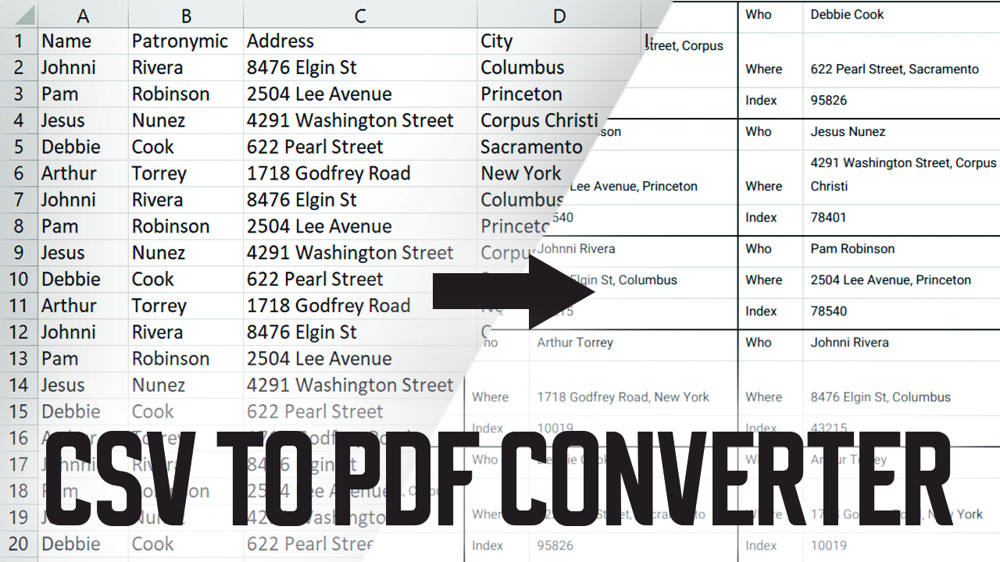

My website: <a href='https://doneeel.com'>doneeel.com</a>

# Python portfolio

Portfolio showing my python skills. There are a few python projects I made

## 1. Converting papers for post

This script can convert csv table to pdf document. Used for creating papers for sendings.
It accepts columns named "Name", "Patronymic", "Address", "City", "Index". Builded using Reportlab and Pandas

1. Name - should be first name
2. Patronymic - should be patronymic
3. Address - should contain full address (street, house)
4. City - name of the city
5. Index - post index

All files, inluding table example and pdf doc example, are in paper_converter folder.
